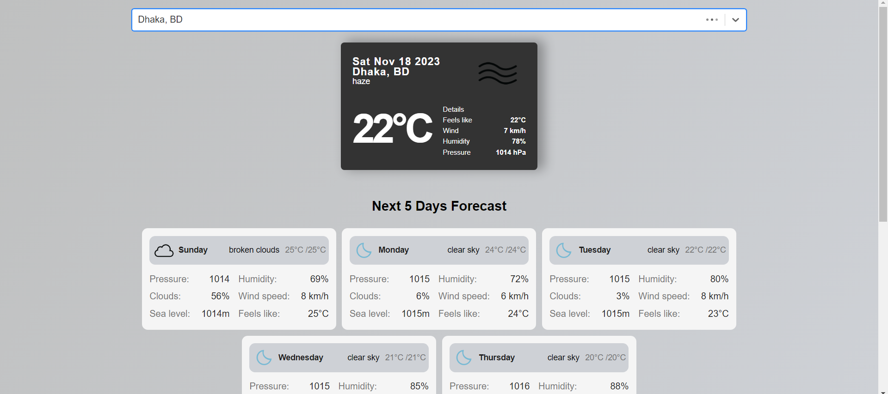
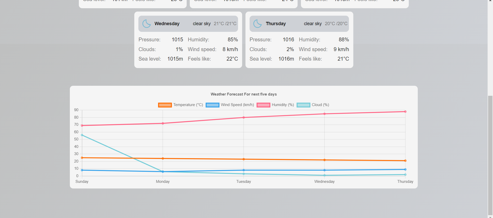

# Weather Dashboard

This is a weather dashboard app with search functionality for geo locations with 5 days forecast information along with a line chart. For this project i used `create vite` as React official docs suggest us to use either a framework like `Next` or bundler like `Vite` and they don't update the create-react-app anymore.

- Used `react-chartjs-2` for showing the line chart.
- `axios` for fetching the data.
- [openweathermap](https://home.openweathermap.org/api_keys) api for weather infos.
- `react-loader-spinner` for loader.
- `react-toastify` for showing error notification.
- `react-select-async-paginate` for search input with debounce.
- Used Vanilla css for styling and responsive design normally i prefer tailwind css and shadcn ui.

## Screenshots

<p align="center">
   
   
</p>

# To run locally

1. Create an account in [openweathermap](https://home.openweathermap.org/api_keys) and get the `api key`.
2. Clone the repository with `git clone https://github.com/Ulrich-Tonmoy/weather-dashboard.git`.
3. Then open the `weather-dashboard` project folder in vs code.
4. Update the `.env` variable `VITE_WEATHER_API_KEY` with the `api key`
5. Open a vs code terminal run `npm i` command to install the the dependencies.
6. Finally run the `npm run dev` and open this link [http://localhost:3000/](http://localhost:3000/) in a browser.

## Expanding the ESLint configuration

If you are developing a production application, we recommend updating the configuration to enable type aware lint rules:

- Configure the top-level `parserOptions` property like this:

```js
   parserOptions: {
    ecmaVersion: 'latest',
    sourceType: 'module',
    project: ['./tsconfig.json', './tsconfig.node.json'],
    tsconfigRootDir: __dirname,
   },
```

- Replace `plugin:@typescript-eslint/recommended` to `plugin:@typescript-eslint/recommended-type-checked` or `plugin:@typescript-eslint/strict-type-checked`
- Optionally add `plugin:@typescript-eslint/stylistic-type-checked`
- Install [eslint-plugin-react](https://github.com/jsx-eslint/eslint-plugin-react) and add `plugin:react/recommended` & `plugin:react/jsx-runtime` to the `extends` list
